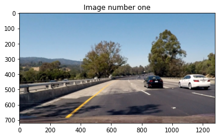
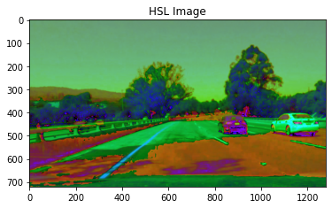
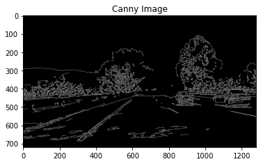
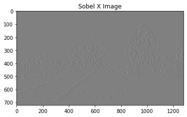
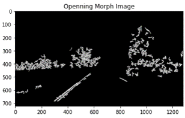

# Simple Perception Stack for Self-Driving Cars

### How to enable debugger:

&nbsp;&nbsp;&nbsp;&nbsp;&nbsp;&nbsp;&nbsp;Change the value of debugger to true

### Methods to choose from:

1. Line fitting Method
2. Curve fitting Method
3. Point fitting Method
4. All Methods

### How to run:

1. Run the Shell
2. Run the Python File in VScode or any IDE
3. Run through the Jupyter notebook

# Description

The pipeline was divided into two major phases : Lane Detectetion and Object Detection (Example: Cars)

## a) Object Detection

This phase was completed by using yolov3 with coco names to detect objects within the frame/image.

## b) Lane Detection

This phase was completed on the following step on the original frame/image then combining it with the object detection to get the result.  

Original Image

1. Apply Gaussian Blur to Image  
   

2. Changing the Image to HLS color  
   

3. Using S channel of the Image  
   

4. Applying Canny Edge Detection on the Image  
   

5. Applying Sobel to remove Horizontal Edges  
   

6. Scaling Sobel to Color Scale  
   

7. Thresholding the Image to clear some noise  
   

8. Apply Openning if needed (too much noise)  
   Note: In this step, we used Skimage Opening, to provide smoother image with less noise however it heavily reduces the performance.  

   Comparison between Opening in both:
   |Open CV | Skimage|
   |:-:|:-:|
   | |  |

9. Apply Algorithim to get Line Points

   |           Left Lane Points           |           Right Lane Points           |
   | :----------------------------------: | :-----------------------------------: |
   |  |  |

10. Combine it according to the method chosen
    | Line Fitting Method | Curve Fitting Method | Point Fitting Method |
    |:-:|:-:|:-:|
    |  |  |  |

# Test Images with all methods

|               Original Image               |                      Line Fitting Method                       |                      Curve Fitting Method                       |                      Point Fitting Method                       |
| :----------------------------------------: | :------------------------------------------------------------: | :-------------------------------------------------------------: | :-------------------------------------------------------------: |
|  |  |  |  |
|  |  |  |  |
|  |  |  |  |
|  |  |  |  |
|  |  |  |  |
|  |  |  |  |
|  |  |  |  |
|  |  |  |  |
